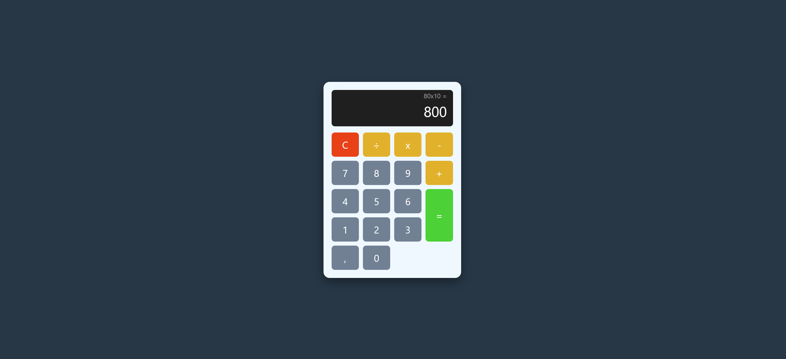

# Calculadora JS

Projeto de uma calculadora web desenvolvida com HTML, CSS e Javascript.

# 📱 Demonstração de suas funcionalidades:

# Explicação da Implemntação de funções  

HTML - A criação das tags foram voltadas pra inserir os botões e criar as classes para os operadores, junto ao botão de calcular, o link com "stylesheet" e o href, está conectando conectando o arquivo HTML com o arquivo de design que é o style.css (personalização da calculadora e página). A section da classe de botões cria uma sessão aonde eles vão ficar na calculadora. No CSS essa classe usa o seguinte comando display: grid para organizar linhas e colunas. O HTML tem uma propriedade que foi inserida chamada "onclick", ao ser acionada ele executará determinada função passando determinado valor. Utilizamos (x) e (÷) como símbolos das operações, mas ao enviar as informações para a tela, o javascript só consegue ler o comando com a barra de divisão (/) e também (*) que é a multiplicação por isso esses símbolos devem estar no código para que ele não seja quebrado. O botão de igual não usa a função (Inserir), ele chama diretamente o calcular() para resolver a operação.

JS - Com o Javascript foram adicionadas as constantes display e historico, o document.GetElementById vai até o HTML e seleciona o visor principal e a linha do histórico. let expressao = "" tem a grande responsabilidade de guardar os cálculos. Na Inserir(Valor), ela é sempre atendida quando você clica em algum botão númerico ou nos operadores. Quando utilizamos o += ele junta e acumula valores. Ex : se clicamos no "1" e depois no "5", ele estára juntando os 2 valores (como se fosse uma concatenção). 
Para que a calculadora não "trave", utilizamos (try) e (catch) ela estára lendo algum cálculo fora do padrão como : 80++-7, assim ela estará vendo uma inconsistência e não irá proseguir com a operação, exibindo a mensagem de (Erro). a funcionalidade que a eval() tem é muito importante, ela pega um texto comum, como este "7+30*8" vai entender que é um cálculo e exibirá o resultado final (247 o resultado da operação). A função expressao = resultado.tostring() vai pegar o resultado transformar ele em texto e ele vai ficar armazenado, ao clicar em +19 ele adiciona o resultado a partir do antigo resultado. A função final Limpar() esvazia o histórico dos cálculos, volta para o ponto inicial que é o valor 0 e apaga qualquer resultado que estava no topo do display.

CSS - 

# 🚀 Funcionalidades
- Operações matemáticas básicas (Soma, Subtração, Multiplicação e Divisão).
- Suporte a números decimais utilizando a vírgula `,`.
- Layout totalmente centralizado e responsivo com design moderno